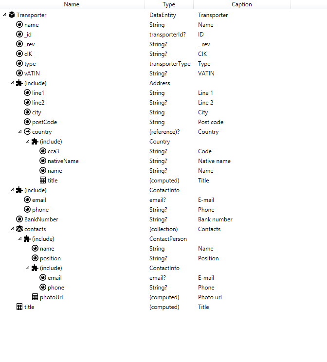
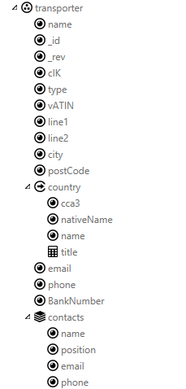

# Data

## Data Entity

Slouží pro definici datové třídy (entity), která je použitelná na více
místech. Lze ji také použít pro rozdělení projektu na data a UI. Entita
se skládá z atributů, kolekcí a dalších struktur. Entita sama o sobě je
pouze předpisem (UML class), instance (UML object) se vytváří až jako
proměnné – Variable (v akci _Local variables_, ve formuláři _Form
variables_, v package _Global variables_).

Pozn.: import z MetaSystému: SF obsahuje možnost opakovaně importovat
struktury zpráv z MetaSystému. Tento import lze provádět opakovaně, a
probíhá tedy přírustkově. V SF lze některé naimportované věci změnit
(např. doplnit atributy, validátory) a import je nepřepíše. Při importu
se zadává, z jaké domény budou zprávy importovány a cílový package.
Doporučume importovat POUZE ty zprávy, které skutečně používáte a v MTS
je modelovat právě tak, jak je v IDE budete potřebovat. SF na rozdíl od
MTS neobsahuje nějaký systém na manipulace s příchozí či odchozí
strukturou.

## Data Attribute – atribut s hodnotou

Pomocí atributů se definují nosiče hodnot (properties, attributes,
fields v konvencích objektového modelování). Atributy mají definovaný
typ, povinnost a případně metadata (Caption).

Podporované datové typy:

- **String** – řetězec. Lze zadat maximální a minimální délku
- **Bool** – logická hodnota ano/ne.
- **Date** – datum (bez času). Lze zadat, zda datum může být
  z budoucnosti či minulosti.
- **DateTime** – datum a čas. Lze zadat, zda datum může být
  z budoucnosti či minulosti a přesnost – na minuty, vteřiny,
  milisekundy.
- **Integer** – celé číslo v rozsahu -9007199254740992 až
  9007199254740992 (dle EcmaScript standard, kap. _8.5 The Number
  Type). Lze zadat minimální a maximální hodnotu._
- **Decimal** – desetinné číslo 
  Lze zadat minimální,  maximální hodnotu a přesnost – tedy počet 
  desetinných míst za desetinou tečkou/čárkou. 
- **metatyp** – umožňuje sdílet základní nastavení mezi více atributy,
  navíc také výčty (viz dále)

Pozor u datových typů Date a DateTime se jedná se o lokální čas, nijak
se nepracuje s časovou zónou. Server a klient tedy musí ít „dohodu“ co
daný den a čas znamená. Nejde tedy o datový typ vhodný pro uložení
„jedinečného historického okamžiku v časoprostoru“.

Povinnosti atributů, zabudovaná omezení a validace (viz dále) jsou
implementována pouze na úrovni propisování hodnot z UI do atributů.

### Decimal a velká přesnost
Datový typ decimal je v IT systémech typicky realizován jako 64 bitové 
IEEE floating číslo, které má přesnost menší, než požadavky na některé 
námi vyvíjené systémy. Proto je typ decimal realizována externí js knihovnou,
která umožňuje pracovat s velmi vysokou přesností. Problémem může být
komunikace s externími systémy, které prostě takovou přesnost neumí. 
Proto lze v [Project settings](/cs/project-structure#project-options) nastavit,
zda je datový typ Decimal serializován standardně v jako číslo, nebo jako String.

## Meta typ

Definuje vlastnosti atributu, které jsou společné více datovým prvkům,
např. IČ. Lze zde také definovat výčtový typ – _Enum_.

### Enum – výčet

Výčtový typ se definuje pomocí MetaTypu, v jehož „Base type“ se vybere
„Enum“. Poté se přidají jednotlivé položky výčtu (_Enum values_), u
kterých se zadává

- název (_Name_), který se bude používat z výrazů (viz Expresion),
- popis (_Caption_), text, který se bude zobrazovat uživateli,
- hodnota (_Value_), která bude interně uložena v atributu

## Computed Attribute – počítaný atribut

Atribut, jehož hodnota (a typ) je definována výrazem (viz Expression).
Používá se v spojení s Bindingem na další vlastnosti komponent a tak lze
dosáhnout změny vzhledu formuláře na základě dat.

## Complex Attribute – komplexní atribut

Kontejner pro další atributy a struktury. Jeho vlastností je
strukturování dat (např. vnořená adresa) a také jejich případné vyplnění
a povinnost. Komplexní atribut je za běhu aplikace vždy přítomen (neumí
mít hodnotu NULL), ale jeho metoda _hasValue()_ vrací _true_, pouze
pokud je vyplněn jakýkoliv podřízený atribut.

**Pozor:** Je-li komplexní atribut nepovinný, volají se validace jeho
podřízených atributů pouze v případě, je-li splněna předchozí podmínka
(tedy _hasValue()_ vrací _true_).

## Reference – odkaz na jiná data

Struktura podobná komplexnímu atributu, jejímž účelem je ale
referencovat nějaká jiná data. Referencovaná data nejsou určena svým
typem (toho lze docílit např. vhodnou jmennou konvencí), ale pouze svým
předpisem (nelze tedy referencovat „Adresu“, ale lze referencovat „něco
co má atributy ulice, město, psč“). Reference nijak neřeší svou
integritu, tato úloha připadá serveru, nebo jiné části aplikace.
V případě serverového řešení je doporučeno, aby klient dostával
reference i se svým obsahem (tedy např. konkrétní položoku číselníku či
jiné tabulky).

## Collection – kolekce dat

Kolekce umožňuje opakování nějaké struktury. Jde o seznam nebo pole
atributů a struktur, které mohou být definovány přímo pod kolekcí. Do
kolekce lze přidávat a odebírat položky. Kolekce slouží pro bindování na
_Repeater_, _DataTable_ a podobné komponenty.

## Include – vložení obsahu entity

Ve všech místech, kde se definuje struktura, dat je možné vložit entity
pomocí Include. Tento mechanismus je použit namísto klasického dědění a
umožňuje mnohem rozmanitější scénáře. V místě, kde je Include použito se
přímo vkládá obsah zvolené entity, pokud je tedy potřeba provést i
zanoření struktury, je vhodné použít např. Complex Attribute a teprve do
něj vložit Include. Jednoduché a běžné použití include je pro vytváření
vazeb mezi entitami. Kombinací definic entit a používáním Include lze
velmi snadno dosáhnout znovupoužitelnosti (reuse) již hotových struktur.
Spolu s dalšími mechanismy (viz modifikátory) lze struktury přizpůsobit
konkrétním potřebám konkrétních formulářů.

Příklad – objekt Transporter (dopravce)

| Data entity s include                              | Výsledná struktura (Variables – Final)             
| -------------------------------------------------- | -------------------------------------------------- | -------------------------------------------------------------------------------------------------------------------------------------------------------------------------------------------------------------------------------------------------------------- |
|  |  | 
Entita Transporter se standardními atributy subjektu  Přímý Include entity Adress  Address obsahuje Referenci s include Country  Reuse entity ContactInfo  Kolekce contacts obsahouje pouze include ContactPerson, ta zas include ContactInfo  
## Validator – validátory

Jednotlivé prvky datových struktur (atributy, kolekce, …) obsahují
možnost přidat si vlastní validátory (_Validators_). Jde o seznam
podmínek (_IsValid_) zapsaných pomocí výrazů (viz Expression) a
příslušných chybových hlášek (_Error message_). Podmínka se zapisuje
pozitivně (např. „Je první písmeno velké?“), musí tedy vrátit _true_
(nikoliv _null_, nebo _false_), aby byla považována za splněnou,
v opačném případě se vyhodnotí výraz s chybovou hláškou a tato hláška je
přidána mezi validační chyby komponenty, která je na prvek navázána.
V podmínce na atributu lze použít výraz „_attr_“, který je zkratkou na
aktuální atribut. Validátory lze pro přehlednost pojmenovat.

Příklad:

_IsValid_:
**SubString**(**attr**,1,1)=**ToUpper**(**SubString**(**attr**,1,1))

_ErrorMessage_: "První písmeno (" + **SubString**(**attr**,1,1) + ")
musí být velké"

Validátory lze také používat na celé struktuře, kolekci, nebo prvku
kolekce. Pokud struktura není prázdná (její hasValue vrací true),
validace se provede rekurzivně směrem dolů.

Validace se spouští teprve při první změně atributu (nebo struktury),
taková data jsou interně nastavena do stavu „touched“, tento stav lze
programově ovládat (viz [setTouched](/cs/expressions#akční-metody)).

## Variables (Action, Form, Global) – proměnné

Samotné entity jsou pouze předpisem struktur (viz výše), teprve v okně
_Variables_ se vytváří jejich instance. Proměnné lze definovat na
formuláři (_Form variables_), globálně pro package (_Global variables_)
a v akci (_Action variables_), chovají se stejně, pouze jejich životnost
se liší.

**Proměnné akce** se vytvoří při jejím spuštění. Vytváří se vždy
s každým novým zavoláním akce, zanikají při provedení posledního
příkazu.

**Proměnné formuláře** jsou vytvořeny při navigaci na tento formulář.
Pokud dojde k navigaci pryč (typ „_Go_“), proměnné zanikají. Speciálním
případem je navigace dočasná (typ „_Go&back_“), kdy zaniká pouze
formulář, ale jeho data zůstávají v paměti prohlížeče a při zpětné
navigaci („_Close navigation_“) se obnoví. Proměnné v první úrovni (tj.
přímo pod uzlem _Form variables_) lze označit jako vstupní (_IsInput_
nastavit na _true_). Hodnoty těchto proměnných lze nastavovat při
navigaci na tento formulář. Pro proměnné formuláře se automaticky
vytváří testovací data. Tato data jsou použita při vizuálním návrhu
formulářů a lze je měnit (viz Test data designer).

**Globální proměnné** se vytváří se spuštěním aplikace a zůstávají
v paměti do jejího ukončení.

_Variables_ mají událost _OnCreate_, kterou lze použít pro naplnění
výchozími údaji.

## Variable modifiers – modifikátory proměnných

Proměnné lze vytvářet pomocí nových struktur, podobně jako entity, nebo
s výhodou použít _Include_ na již hotové entity. Protože však potřeby
každého formuláře jsou jiné a typicky si potřebuje přidat své počítané
atributy, které by zaneřádily společně používané entity, je možné (a
doporučené) k inkludovaným strukturám přidávat další (především počítané
atributy, či atributy s významem „vybraná položka“, apod.). Toho lze
dosáhnout pomocí kontextového menu _Local change – Add_. Stejným
způsobem (_Add events and validators_) lze přidat událost která se na
dané struktuře bude spouštět pouze na daném formuláři, nebo validátor,
který se má kontrolovat pouze na daném formuláři. Tato událost či
validátor jsou spouštěny stejně, jako by byly v původní struktuře, navíc
mají k dispozici kontext celého formuláře, nikoliv jen původní entity.

## Události na datech

Datové objekty obsahují události, které umožňují definovat chování na
úrovni entit. Obdobné události jsou přístupné také na proměnných (tedy
instancích entit).

| Event                  | Where                                                                 | Parameters                                                                                                 | Comment                                                                                                                                                                                                    |
| ---------------------- | --------------------------------------------------------------------- | ---------------------------------------------------------------------------------------------------------- | ---------------------------------------------------------------------------------------------------------------------------------------------------------------------------------------------------------- |
| OnCollectionItemChange | DataCollection                                                        | data : collection item   triggeredByUser : bool                                                  | Occurs when any of attributes, or attribute in deep structure (complex, etc.) is changed (and it's OnChange is fired). Parameter triggeredByUser contains true, if this event is fired from ui interaction |
| OnCreate               | Action context,   Form variables,   Global variables   |                                                                                                            | Occurs when this structure is created. Can be used for initializing default values.                                                                                                                        |
| OnChange               | DataAttribute                                                         | data : owner structure (complex, reference, collection item, data entity)   triggeredByUser : bool   | Occurs when value of this attribute is changed. Parameter triggeredByUser contains true, if this event is fired from ui interaction                                                                        |
|                        | DataEntity                                                            | data : DataEntity itself   triggeredByUser : bool                                                    | Occurs when any of attributes, or attribute in deep structure (complex, etc.) is changed (and it's OnChange is fired).                                                                                     |
|                        | DataComplexAttribute                                                  | data : complex structure   triggeredByUser : bool                                                    | Occurs when any of attributes, or attribute in deep structure (complex, etc.) is changed (and it's OnChange is fired).                                                                                     |
|                        | DataReferenceAttribute                                                | data : owner structure   triggeredByUser : bool                                                      | Occurs when value of this reference attribute changed, but doesn't fire when any data of referenced values changed.                                                                                        |
|                        | Action context,   Form variables,   Global variables   |                                                                                                            | Occurs when any of attributes, or attribute in deep structure (complex, etc.) is changed (and it's OnChange is fired).                                                                                     |
| OnUserChange           | Same as OnChange                                                      | data same as OnChange                                                                                      | Occurs when data are changed by user                                                                                                                                                                       |
| OnItemAdded            | DataCollection                                                        | data : added item                                                                                          | Occurs when item is added to this collection.                                                                                                                                                              |
| OnItemRemoved          | DataCollection                                                        | data : collection                                                                                          | Occurs when item is removed from this collection.                                                                                                                                                          |

[HOME](/index.md)
