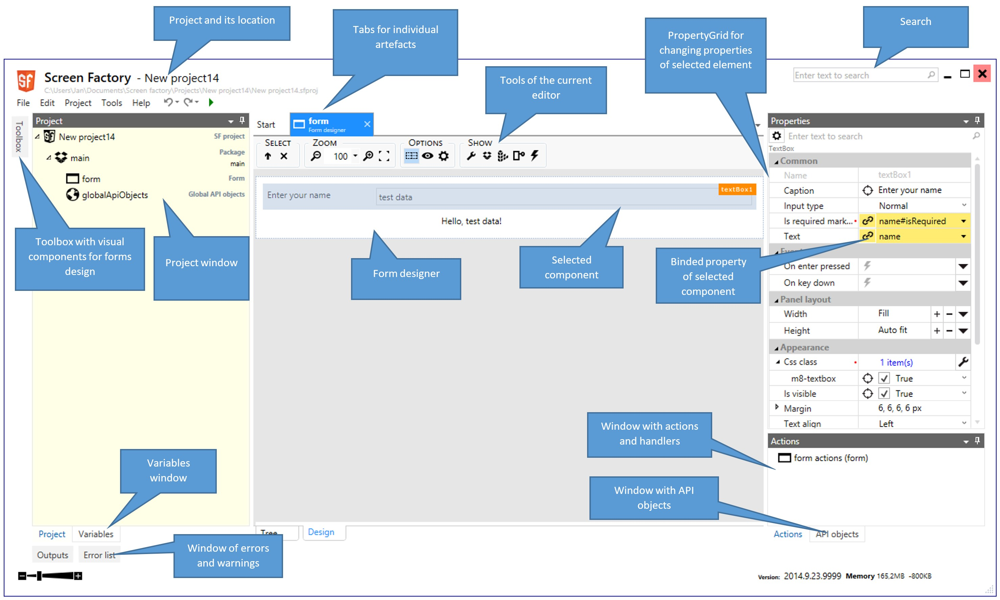

# Ovládání IDE

## IDE docking windows

IDE obsahuje možnost přizpůsobení rozvržení jednotlivých oken, typicky
dle velikosti a aktuální práce vývojáře. Jednotlivá okna jdou
přetáhnout myší, „zaparkovat“ v jiných pozicích (u hran nebo na jiných
oknech), vytvářet skupiny se záložkami a zasouvat do stran. Toto
ovládání se neliší od podobných nástrojů (Enterprise Architect, Visual
Studio, apod.). Vlastní práce s jednotlivými artefakty se provádí
především ve střední části, mezi otevřenými artefakty se lze přepínat
pomocí záložek (nebo Ctrl+Tab). Rozvržení oken lze resetovat do původní
podoby (menu _Tools – Layout reset_), rozvržení se ukládá spolu
s projektem (ale do zvláštního souboru).

Vlevo dole je možné ovládat měřítko celé aplikace (  ). 
Aplikaci je možné v nastavení přepnout do tmavého tématu (Dark theme).

## Menu

Obsahuje standardní příkazy pro otevření, uložení projektu apod.

Tlačítka  resp.  slouží pro krok zpět (Undo, Ctrl+Z) resp. krok vpřed (Redo, Ctrl+Y).
Tlačítko zelené šipky slouží pro vytvoření a spuštění aplikace (Build, F9).

V menu _Help – Report suggestion or bug_ lze reportovat chybu nebo nápad
na novou funkcionalitu. Předem děkujeme .

## Preferences – nastavení IDE

Pomocí menu (Edit-Preferences) lze vyvolat nastavení IDE. Zde lze
nastavit některé vlastnosti, mezi ty důležitější patří:

- **Save project before build** – zda se má projekt před spuštěním
  vždy uložit
- **Stop build on errors** – zda lze před spuštěním ignorovat chyby
- **Open result in browser** – který prohlížeč se použije pro otevření
  projektu. Zde jsou nabídnuty nalezené nainstalované prohlížeče.
  Položka Internet explorer (managed) umožňuje spouštět aplikaci ve
  stále stejném okně Internet Exploreru, je tak zjednodušena práce při
  ladění aplikace. Jiné prohlížeče tuto možnost nemají.
- **Editor options** – jak má vypadat designer formulářů. Pro
  zrychlení práce s IDE lze zvolit „only tree“.

Kromě nastavení IDE ještě existuje [nastavení projektu](/cs/project-structure#project-options.md).

[HOME](/index.md)
