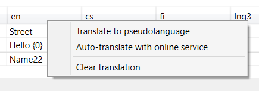
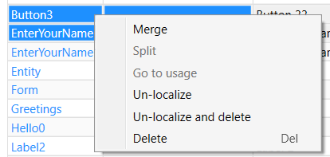
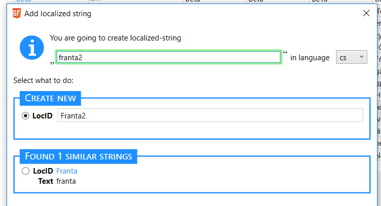
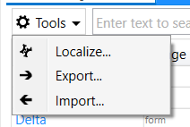
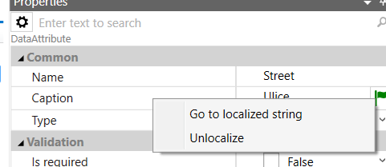
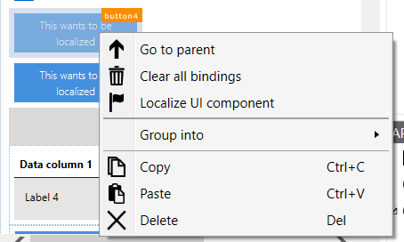

# Lokalizace

Lokalizací je myšlena možnost vytvářet v SF aplikace, které lze přepínat
mezi více jazyky. Samotné SF IDE je pouze v anglickém jazyce a není
záměrem ho lokalizovat.

Lokalizaci pro projekt je potřeba nejdříve zapnout. To se provede v menu
_Project - Project Options - Localization enabled_.

Poté nastavte v *Properties* kořene projektového stromu Languages –
jazyky, které budete používat. Musí se jednat o jazyk, který už
ScreenFactory podporuje. Vzhledem k tomu, že pro podporu jazyka je
nezbytné, aby ScreenFactory znala formáty čísel a datumů, texty
základních validačních chyb apod., nejsou podporovány automaticky
všechny jazyky. V této chvíli podporujeme tyto jazyky:

- Angličtina (en)
- Čestina (cs)
- Srbština (rs)
- Finština (fi)
- Švédština (sv)
- Černohorština (me)

Pokud jazyk, který potřebujete, ještě podporován není, obraťte se na
vývojáře ScreenFactory.

Ve stejném místě je nastavení aktuálního jazyka „Language“, které lze
také přepínat novým přepínačem v pravé části aplikačního menu
(standardně nad property gridem). Tímto přepínačem se řídí

- výchozí jazyk aplikace, nastavení runtime tj. např. kalendář,
  formátování datumu atd.
- jazyk pro form designer
- výchozí jazyk pro vývoj v IDE – na některých místech se budou
  zobrazovat texty vybraným jazykem

Pozn.: Language se dá nastavovat i v nelokalizovaném projektu. Řídí se
jím nastavení runtime, tj. formáty datumů a čísel, jazyk zabudovaných
validátorů apod..

## Co se lokalizuje

- některé vlastnosti datových objektů (v tento moment pouze Caption)
- řetězce použité v expressions
- některé textové vlastnosti UI komponent (např. Caption, Text, apod.)

Ve výchozím stavu je lokalizovaný pouze runtime. Při lokalizaci potřeba
určit, které položky chceme, aby byly lokalizované. Toto je nutné
opakovat pro každé přidané elementy (entity, atributy, obrazovky ...).

## Jak se překládá

V každém package se vytvoří jeden globální uzel "localizations" (lze
přidat v Project tool), po rozkliknutí je k dispozici _Localization
designer_. Ten umožňuje editaci seznamu řetězců (identifikovaných tzv.
LOCID) a jejich textů v jednotlivých jazycích.

## Localization designer

Tabulka s lokalizovanými řetězci, ve sloupcích jsou jednotlivé jazyky.
Druhý sloupec lze pravým tlačítkem nad záhlavím nastavit pro zobrazení
seznamu objektů, které řetězec používají.

Tabulka je určena pouze pro drobnou editaci, na vlastní překládání a
řízení stavu překladu jednotlivých položek nebo packages použijte
nástroje Export a Import.

Na sloupcích s jednotlivými jazyky lze vyvolat myší kontextové menu.

Pozn.: Na prvním jazyce používejte s rozvahou!

- _Translate to pseudolanguage_ – vytvoří pseudopřeklad z prvního
  jazyka pomocí unicode symbolů, které přidají různé akcenty.
- _Auto-translate with online service_ – pokusí se přeložit z prvního
  jazyka pomocí služby Microsoft Cognitive Services.

Pozn.: Služba Microsoft Cognitive Services – Translator API může
potřebovat konfiguraci správného kódu jazyka. To se provede přidáním
resource kamkoliv do projektu. Resource se musí jmenovat
„microsofttranslator.ini“ a pro namapování vaší zkratky jazyka na MS kód
do souboru přidejte např.:

\[LangMap\]
;namapuje mylng na Srbštinu v cyrilici/azbuce
mylng=sr-Cyrl

Pozn.: Služba používá cloudové služby MS Azure pod účtem vývojářů. Běží
v režimu Free, což umožňuje měsíčně přeložit 2 milióny znaků. Pokud by
to v konkrétním případě nestačilo, lze dočasně řešit přepnutím na
placenou variantu \$10/milion znaků.

Řádky s jednotlivými řetězci lze vybírat (i více najednou) a vyvolat
kontextové menu:

- _Merge_ – spojí více řetězců dohromady, nahradí prvním z nich a
  všechny odkazy přesměruje na první z nich.
- _Split_ – rozdělí použití řetězce na jednotlivé případy
- _Go to usage_ – zobrazí místo použití daného řetězce
- _Un-localize_ – zruší všechny lokalizace, které používají vybraný
  řádek a případně řádky smaže
- _Delete_ – smaže řetězec. Lze pouze u řetězců, které se nikde
  nepoužívají.

LocID lze změnit, automaticky se promítne do expressions, kde je použit.

Kliknutím na poslední řádek (_+Click here to add new item…_) lze přidat
nový řetězec, který je pak možné používat v expressions.

Dialog po zapsání řetězce nabízí možnost změnit LocID, případně použít
již existuící stejný, nebo podobný řetězec. Pozor na volbu správného
jazyka ve vyběru vpravo nahoře (přebírá se z aktuálního nastavení IDE).

## Nástroje

V hlavním menu Tools-Localize, nebo v rozklikávacím menu Tools v záložce
s Localization designer lze najít nástroje pro pomoc s lokalizací:
 
- _Localize_
  – umožňuje hromadně zlokalizovat vybrané package – entity,
  expressions, UI komponenty
- _Export_ – exportuje vybrané packages a languages do excelu. Pro
  správnou funkci je nutné mít nainstalovaný MS Excel.
- _Import_ – importuje texty z excelu. Ideální stav je importovat
  dříve vyexportovaný soubor funkcí _Export_. Pro správnou funkci je
  nutné mít nainstalovaný MS Excel.

## Lokalizovatelné property

Na datových prvcích (entity, atributy, kolekce atd.) se na vlastnosti
Caption objeví vlaječka, která umožňuje sledovat stav lokalizace (po
přejetí myši), nebo vlastnost zlokalizovat. Kliknutím na vlaječku se
zobrazí menu.

## Expressions

Jednotlivé lokalizované řetězce jsou v expressions k dispozici jako
_localized.{LocID}_, např. _localized.Hello_. Tyto výrazy mají v runtime
hodnotu podle aktuálního jazyka. Při spojování řetězců použijte funkci
_stringFormat(format, param1, param2, …)_ s tím, že první parametr
obsahuje formátovací řetězec a místa pro vložení dalších parametrů jsou
pomocí {N}, kde N je číslo parametru číslované od 0. Výsledkem
_stringFormat("Hello,_ _{0}!",_ _"Karel")_ tedy bude *"*Hello,
Karel!_"_. Jako první parametr typicky použijete lokalizační řetězec,
takže např. _stringFormat(localized.HelloFmt, this.name)_.

## UI komponenty

Konstantní řetězce v UI mohou být zlokalizovány ručním způsobem – tj.
vytvořením lokalizačního řetězce, vytvořením _ComputedAttribute_ ve
variables daného formuláře a nabindováním komponenty na tento počítaný
atribut.

Stejnou funkci provede na vybraných komponentách položka _Localize UI
component_ z kontextového menu ve _Form designeru_.

[HOME](/index)
