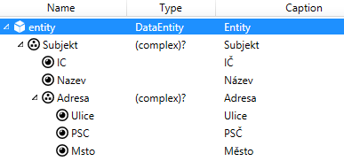

# Hlavní okno a záložky

Dvojkliknutím do nějakého artefaktu v podokně _Project_ se ve většině
případů otevře nová záložka s funkcí editace daného artefaktu. Některé
záložky se otevírají z _Properties_. Pokud při otevírání držíte klávesu 
ALT, otevře se do "druhé poloviny", na velkém monitoru tak můžete mít 
před sebou více artefaktů najednou. Pokud je již záložka otevřená, nová 
se již neotevírá, aktivuje se existující.

## Form designer

Vzhled formulář se skládá z komponent. Komponenty mohou mít v sobě další
komponenty. Strukturu formuláře si tedy lze představit jako strom. Na
komponenty lze nahlížet ve dvou různých zobrazeních. Jedním z nich je
právě tento logický strom komponent. Druhým zobrazením je vizuální
náhled na formulář (designer). Mezi těmito zobrazeními lze přepínat.

Designer je WYSIWYG editorem formuláře. Formulář je editován ve své
podobě tak, jak bude prezentován uživateli ve výsledné aplikaci, jen
s několika málo rozdíly – kolem komponent lze zapnout umělý okraj pro
lepší orientaci, lze zapnout zviditelnění komponent (IsVisible=false),
komponenty dostávají jako vstup testovací data (viz [Test data
designer](#Test data designer)). Měřítko zobrazení lze měnit pomocí
nástrojů v horní příkazové liště.

Komponenty lze přetahovat myší (zobrazí se indikátor, kde bude
komponenta umístěna), nové komponenty se vytváří přetáhnutím myší
z toolboxu. Další příkazy jsou dostupné z kontextového menu (pravé
tlačítko myši).

Dostupné příkazy (ne vždy jsou dostupné všechny)

- _Copy, Paste, Delete_ – kopírování, mazání
- _Go to parent_ – výběr přejde na nejbližšího „rodiče“
- _Clear all bindings_ – v komponentě a všech podkomponentách se smaže
  veškerý binding (slouží hlavně při kopírování)
- _Localize UI component_ – provede lokalizaci komponenty – textové
  property jsou nahrazeny bindingem na lokalizační řetězce
- _Add to children_ _/ Set content_ – do vybrané komponenty přidá
  novou komponentu vybranou z podmenu
- _Replace parent_ – nejbližšího rodiče nahradí vybranou komponentou
- _Group into_ – na místo vybraných komponent je vložen vybraný
  kontejner a původní komponenty jsou vloženy jako jeho podkomponenty
- _Transform to_ – komponenta je nahrazena jinou a všechny vlastnosti,
  které se stejně jmenují jsou zkopírovány.

Některé komponenty mohou obsahovat pouze jednu další – pak je možné sem
umístit jiný kontejner (např. Panel) a do něj již lze vkládat další
komponenty. V defaults.ini (viz [Resources](Resources.md)) lze nastavit
výchozí vlastnosti komponent při jejich vytváření.

Zobrazení designéru lze přepnout do stromového zobrazení hierarchie
komponent, zde lze poté v kontextovém menu vytvářet i nové komponenty.

Při vývoji formuláře jsou typicky používána i okna Variables,
Properties, Actions and API objects (viz [Pomocná okna](tool-windows.md)).

### Data-to-form

Při přetažení datové struktury z podokna Variables na formulář je
vyvoláno generování formuláře z dat (Data-to-Form). Po přetažení vyskočí
dialog, ve kterém lze nastavit, jaké komponenty se z jakých datových
typů vytvoří, případně další vlastnosti. Toto nastavení je možné změnit
pouze pro tento okamžik, nebo uložit do projektového nastavení.

Zobrazování dialogu lze potlačit stiskem tlačítka SHIFT při tažení myší,
nebo odškrtnout volbu „_Do not show this dialog next time_“. Pokud je
naopak potřeba dialog zobrazit, stačí podržet tlačítko ALT.

## Data designer – návrh datových struktur

Stromový návrh znovu použitelných datových struktur (viz [Data
entity](/cs/data.md)). Do entity lze vkládat další struktury pomocí
kontextového menu nebo z toolboxu, data lze přeskládat tažením myši ve
stromu.

U jednotlivých položek struktur (atributy, kolekce apod.) lze nastavovat
události – událost se poté spouští ve všech případech použití těchto
struktur. Např. OnCreate lze s výhodou použít na prvotní naplnění daty,
OnChanged na vypočítávání hodnot při změně apod.

Pokud schránka obsahuje text, nebo formátovaný text s odsazenými názvy
hodnot, lze do stromu vložit takovou strukturu (CTRL+V) a ta bude
převedena na atributy a komplexní typy.

Pokud vložíte text

    Subjekt
      IČ
      Název
      Adresa
        Ulice
        PSČ
        Město

designer vygeneruje

### Action designer – zadávání prováděcích příkazů

Poznámka: tato funkcionalita byla dříve vizuální, nyní pouze textová.

Vytváření a úprava akcí pomocí textového jazyka ActionLang nebo
javascript. V záložce tests lze definovat „unit testy“ pro danou akci.
Více viz [Akce](actions.md).

## Test data designer

Pro [form designer](/cs/main-window#form-designer.md) je důležité, aby existovala
testovací data. Jednak si díky nim si vývojář lépe představí, jak bude
formulář vypadat, ale hlavně, bez nich by komponenty, které jsou
navázány na kolekce záznamů jako jsou Repeater či DataTable, vypadaly
prázdné a bylo by obtížné vytvářet jejich obsah.

Testovací data se sama vytváří na základě definice Variables na každém
formuláři. Data jsou generována pseudonáhodně tak, aby vyhověla definici
dat. Pokud je potřeba testovací data přizpůsobit, lze to provést na podokně
Variables (ikona  ). Data
jsou editovatelná v textové podobě ve formátu JSON. Umístěním kurzoru do
příslušného místa se zobrazuje definice datových struktur. Pokud jsou
data smazána, nebo nejsou validním JSON dokumentem, jsou vygenerována
data nová.

Pravým tlačítkem _Regenerate test data_ lze data přegenerovat. Pro
generované texty se uplatňuje omezení maximální délky nastavitelné ve
[vlastnostech projektu](project-structure.md#Project options), defaultní
hodnota je 60 znaků.

[HOME](/index.md)
