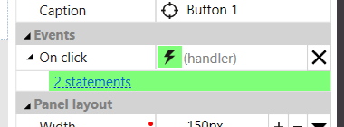

# Actions

Actions can be used to react to certain events, usually triggered by
user on some component. They may be on a form (_Form actions_) or they
may be globa (_Global actions_).

Actions are used for handling the events or to be called from other
actions. To attach the action to and event, first choose a component on
the form and then find suitable event in properties window (ie. On
click). With the help of menu under arrow create new action or use
existing. Once the action is attached to an event, Description or short
generated description is displayed. Click on green lightning button gets
you dirrectly to given action.

Actions window enables to create purely javascript actions and call them
directly from other actions and events. In normal situations it is not
recommended doing so as such actions cannot be checked during design
time, there is not support for changing them if some data element
changes name etc. They require deep knowledge of the runtime and may get
broken if runtime implementation changes. Javascript actions are
therefore supported only as temporary workaround.

Due to asynchronous nature of javascript implementation, it is possible
that some actions will take very long time to finish. If such action is
triggered by user, you may need to prevent him to start multiple
instances in parallel. You may for example temporarily disable the
button at the start of the action and enable it again at the end of it.

# Actions in ActionLang

Actions are text scripts in ActionLang language using statements and
language constructs mentioned later.

## Expressions useable in actions

Expressions in actions have all the features as Expressions used in
computed attributes. On top of it, they can do few more things:

- they may address local variables of actions and control variables of
  cycles
- they may call **synchronous** methods of api objects, ie.
  \\\\form.**apiobjects**.configValue1.**get**()

## Comments

Comments may be used in actions as _// comment_ or \*/\* multiline
comment \*\*/ and they have on effect on their functionality. They are
generated as javascript comment in debug mode.

## Branching of the program flow

### If

To define condition, you can use _if_. Its usage looks like this

    if condition then
      statements_if_condition_is_true
    endif

or

    if condition then
      statements_if_condition_is_true
    else
      statements_if_condition_not_true
    endif

Indentation is not mandatory but recommended as it makes the code easier
to read. If condition is true, the statement block in **_then_** is
executed. Otherwise, (condition is false or null) the optional
**_else_** block is execute.

Example

    if form.isValid() then
      system.console("Data is valid")
    else
      system.console("Form contains validation errors")
    endif

To make work with null easier and more readable, you may use functions
isTrue(), isFalse(), isTrueOrDefault() or isFalseOrDefault().

### Ternary operator

The other option to make condition is to use ternary operator
expression, ie:

    system.console(form.isValid() ? "Data is valid" : "Form contains validation errors")

## Assignment

Syntax for assignment is

    target = expression

Target on left side may be data attribute (ie. _form.name,
globals.userName, form.data.header.MRN_) or local variable created in
action with keyword _var_. It is not possible to assign value to
computed attributes and neither to the results of lambda methods that
return enumerable. Expression, that is assigned must be of the same type
or compatible type as a target type, otherwise it is has to be explicity
converted.

Example of assignments

    form.name = "Fantomas"
    globals.userName = "medved009"

## Variable declaration

Syntax for variable declaration is

    var variableName = expression

Declaration will create new variable (name has to be unique in given
action) of the same type as is the expression and assign its value.

It is possible to assign not only basic types but as well complex and
collection attributes. In such case these are not copied but instead the
variable holds a reference to them and it may be used to shorten and
simplify the script. For example

    var h = form.data.header
    h.MRN = "CZ18123412341234"
    h.ID = 42
    h.Title = "some title"

## Method call

Syntax for method call is

    methodName(parameter1, parameter2, ...)

or

    someObject.methodName(parameter1, parameter2, ...)

This will call a method for given context. These contexts may be for
example data elements and API objects.

    form.collection1.addItem()
    form.apiObjects.configValue.set("new value")

## Calling of other actions

Calling other actions looks similar to calling methods. Local actions
are available on the context _form.actions_ while global actions are on
context _actions_.

    form.actions.saveAllData()

    actions.refresh(true)

## Calling methods with parameters and/or return value

It is possible to define data elements (attributes, complexes etc.) in
an action in Variables window. If it is an attribute of basic type, you
may mark it with "Is input" and such attribute will become an input
parameter. If you mark it with "Is input required" as well, it will be
mandatory otherwise it is optional. In similar way, you may mark some
attribute with "Is result" to make it "result variable" and that way to
be able to return value from the action. You may assign it directly by
name or by using keyword result. These attributes may be accessed
directly by name or with context _this_.

For javascript actions it is possible to use a trick, if name ends with
underscore and number, SF requires to fill that many parameters and does
not check its types, ie. action_with_one_parameter_1.

Calling actions is similar to calling other methods. Use context
_form.actions_ or _actions_ and add parameters if there are any.
Parameters that are not required are possitioned after those that are
and you may skip them. Result of calling (if there is any) may be
assigned to something, ie.

    var isValid = form.actions.validateSubjects(1, "test")

Calling other action is always asynchronous, so it is not possible to
chain it with other calls.

## Synchronous and asynchronous methods

Method calls may be even part of expressions (if they return something),
even if it is API object method (which is not possible in expressions
outside actions). But some methods are marked as asynchronous and their
name ends with Async. Such methods may be called only as separate
statement or expression that contains only this call. Calling other
action is always asynchronous as well. Statements that follow this call
will be executed only after this asynchronous action ends. For example:

    // this is OK, it is synchronous method
    var result2 = form.apiObjects.config1.get() + "/" + form.apiObjects.config2.get()

    // toto je OK, it is asynchronous method but it is simple expression, not combined with any other operations
    var result1 = form.apiObjects.myRest.requestAsync("GET", "/api/country/list")

    // this is NOT OK, it is asynchronous method so it may not be part of complex expression
    var result3 = "/" + form.apiObjects.myapi.doAsync()

## Iterations

### Foreach

Syntex is

    foreach controlVariable in iteratedExpression do
        statementBlock
    endfor

This will repeate the _statementBlock_ for each item in
_iteratedExpression_. Every item will be available in _controlVariable_
for given pass. Iterated expression is an expression that returns
multiple objects, so either collection or _lambda methods_ on
collection. _controlVariable_ cannot be changed inside the
_statementBlock_ but its properties can be. For example:

    foreach f in form.collection1 do
        f.attribute1 = "a"
    endfor

### While

    while condition do
        statementBlock
    endwhile

This will execute statement block over and over again as long as
condition is true. If the condition is not true before the first pass
the statementBlock is not executed at all. Be mindful that if the
condition is always true, the cycle will never end (and your application
may appear "stuck" or it may crash if it runs out of resources).

NOTE: While is not implemented in generator yet.

[HOME](1index.md)
