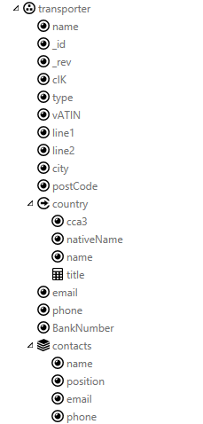

# Data

## Data Entity

Data entity is a structure you can define and use it on multiple places.
It may as well help you in splitting the data model and UI. Entity is
composed of attributes, collections and other structures. Entity itself
is only definition (similar to UML class), instance of such definition
is created when you used this entity on the form _Form variables_, in
action _Local variables_ or globally in package _Global variables_).

Note: Import from Metasystém. ScreenFactory has a tool for importing
structures of messages from Metasystém. This import may be done
repeatedly. It is possible to change the imported structures later in
ScreenFactory (ie. to add more attributes or validators) and import will
keep those changes. During import, you define which domain you want to
import from and target package. We recommend to import only those
messages, that are going to be used in the client, and to model them in
Metasystem in such way the client needs them to be. Metasystem has
better tools for data transformations and manipulations than
ScreenFactory, and at the moment, we have no plans to implement similar
things to ScreenFactory as well.

## Data Attribute

Data attributes may hold a value or defined type or they may be empty.
This value may change during runtime. This value may be accessed from
actions and it may be bound to component properties. Attributes have
defined type, they may be required or not and they have other metadata
(ie. Caption).

Supported data types:

- **String** – one or more alphanumeric characters. Validators for
  minimum and maximum length are supported out of the box.
- **Bool** – logical boolean value - true/false
- **Date** – date without time part. Out of the box we support whether
  it may be in the future and whether it may be in the past
- **DateTime** – date with time part. It has same built-in validators
  plus setting for its precision (minutes, seconds, miliseconds)
- **Integer** – integer number in range -9007199254740992 až
  9007199254740992 (see javascript
  [https://developer.mozilla.org/en-US/docs/Web/JavaScript/Reference/Global_Objects/Number/MAX_SAFE_INTEGER](Number.MAX_SAFE_INTEGER));
  built-in validators for minimum and maximum
- **Decimal** – decimal number with arbitrary precision. Built-in
  validators for minimum, maximum and for precision
- **metatyp** – special type that allows you to share type and
  validation setting between multiple attributes and which as well
  allows you to use enum type

Date and DateTime do not contain timezone information.

Whether attribute is required or not, minimums, maximums, precision etc.
mentioned earlier are only a shortcut for validations. As other
validations it does not mean that the attribute may not hold values that
breach this limitation. But if it does, validation error is indicated.
There are few cases though, where component may take this information
and already limit the user during data entry, ie. DatePicker component
may not show the time part if it is bound to Date in comparison to
DateTime and it may limit the precision of time entry based on precision
setting of DateTime attribute.

## Metatype

It may be used to define properties for multiple attributes and as such,
work as a tool for reuse of this definition. It may as well enable you
to define _enum_, that is type that holds one of defined set of values
that have their value and caption.

### Enum

This type can be only defined through Metatype. Base type of this
metatype has to be set to _Enum_ and then it has to have set of _Enum
values_ defined. Each of them can have

- _Name_, it will be used in expressions
- _Caption_, text that will represent the value if it is displayed to
  the user
- _Value_, value that will be kept in the attribute itself

## Computed Attribute

Computed attributes do not hold a value (in comparison to data
attributes) and thus cannot be set to any value either. Instead they are
defined by an expression and automatically recalculated anytime its
expression dependencies change. It may be handy in transforming some
values before they are displayed to the user, in changing UI state based
on value of some data attributes etc.

## Complex Attribute

Complex attribute is simply a container for other attributes (including
other complex attributes, collections or references). Its purpose is to
structure the data in the tree instead of having them as a flat set
only.

It does have a Required property and unlike normal data attributes, it
has a special use as well. Not only does it check whether the complex
attribute has value (that is any inner attribute has value) or not, but
it as well affect the working of the validators on inner attributes. As
long as complex attribute is not required and it is empty, validators on
inner attributes are not checked. Once it has value, they start to work
as usual.

This may be used for a scenario where you have some part of data not
mandatory and ignore any validation errors there as long as user does
not start to fill it. For example you may have an address that is not
required but if it is set at all, its city has to be set. In such case
you want to set the complex attribute Required=false but
City.Required=true. Once it is not empty - user started to fill data in
the address - all validators on inner attributes will start to work.

## Reference

Reference is structure very similar to complex attribute. Its purpose is
to reference data that came from other place. It is not part of the
definition where the data are coming from (although you may easily get
that by using suitable naming convention) only how its structure look
like. Reference does not attempt to check data integrity. If the data
are coming from server we recommend the server to send the references
with whole content (not only code but also description for example).

## Collection

Collection allows repetition of data structure. It is a list of
attributes and structures that may be defined directly within a
collection. Collection size is dynamic, it is possible to add and remove
items, and maximum number of items is limited only by browser resources
(memory etc.). Collection can be binded to _Repeater_, _DataTable_ and
similar components.

## Include

Include is mechanics how to use Data entity. It works as a type of
composition with includes and data entity being transparent. The content
of included data entity is placed directly on the place of include. That
means the attributes of the target are mixed with DataEntity content. If
that is not what you want and you intend to have the included attributes
structured inside its own "branch", you may first use Complex and put
the include inside. The combined content of included attributes and
original attributes siting side-by-side in the same structure still has
to respect the rule that attribute names have to be unique in given
structure.

Included content may contain validators, events and other metadata, but
it may as well be slightly extended with more validators and events (see
[variable modifiers](data.md#Variable modifiers)).

### Example – object Transporter

| Data entity s include                              | Result structure (Variables – Final)                 | Notes                                                                                                                                                                                                                                                                                                                            |
| -------------------------------------------------- | ---------------------------------------------------- | -------------------------------------------------------------------------------------------------------------------------------------------------------------------------------------------------------------------------------------------------------------------------------------------------------------------------------- |
|  |  | Transporter entity with standard attributes of the subject.    Direct Include of Adress entity.    Address contains Reference with Country entity include.   Reuse of entity ContactInfo.   Collection contacts contains only included ContactPerson, and that one includes ContactInfo. |

## Validators

Individual data elements (attributes, collections etc.) have the ability
to have validators. It is a list of conditions defined by
[expressions](expressions.md) in property _IsValid_ and error messages in
property _Error message_. The expression should return true if the data
is valid. If it returns something elese (_false_ or _null_), data
element is considered invalid, validation error is potentially shown in
UI, and if queried from the action or in another expression with
IsValid() it returns false. It is possible to use context _attr_ when
defining the expression and it will represent given data element. It is
good practice to give validators meaningful name.

Example:

_IsValid_:
**SubString**(**attr**,1,1)=**ToUpper**(**SubString**(**attr**,1,1))

_ErrorMessage_: "First letter(" + **SubString**(**attr**,1,1) + ") has
to be upper case"

Validators may be used on the complex and reference attribute,
collection or collection item. If the structure is not empty, validation
is done recursivelly for inner elements as well.

### Touched

While validations are happening separatelly from the UI (everything is
validated, no matter whether user already set or modified it) it is
common that you do not want to show validation errors until user either
set or change the data or tries to submit the form. For this we have
another flag "touched" that is automatically monitoring this. Validation
error on most editors is shown only if touched is true. It is possible
to change this state from the action using method _isTouched_.

## Variables (Action, Form, Global)

ViewModel is split between local data of a form (_Form variables_),
global data context (_Global variables_) and action data contexts
(_Action variables_). These contexts can be modelled in Variables window
and you may either create them directly there or include some Data
entity you defined earlier (or got as a result of import from MTS).

_Variables_ have event _OnCreate_ that can be used to prefill them with
some data for example.

### Action variables

Action variables structure is created before the action is executed an
it is disposed of once the execution ends.

### Form variables

Form variables are created in reaction to navigation to given form,
right before the form is showin in UI. Once you navigate from this form
away with navigation type _Go_, form variables are disposed of.

If you navigate away only temporarily with navigaty of type _Go&back_,
data is kept in the memory and used later when you return back to the
form by calling _Close_.

Variables of basic type on the root level of Form variables may be
marked as _Is input_ and _Is input required_. This makes them similar to
input parameters of an action. Navigation on this form will require
values for such attributes that are marked with both _Is input_ and _Is
input required_ while those that are only _Is input_ may be optionally
set in the navigation by "with&lt;Something&gt;" method.

Test data is automatically created for form variables, they are used in
visual designer and they may be changed.

### Globální variables

Global variables are created at the moment of application start and they
stay in memory until the user leaves the application.

## Variable modifiers

Instead of designing the data directly, you may as well use includes of
Data entities. But if you do so, you may encounter the need to tune it
slightly for each form. You may need to add specific attributes inside
some included complex or collection, add computed attributes, react to
some events. To achieve that, there is an item _Local change - Add_ in
context menu of included content and _Add events and validators_. Such
events and validators have access to whole variables context, not only
the entity. These changes are only applied in given place, not
everywhere where the entity is used.

## Data events

Data objects have events that allow you to define their behaviour on
data entity level. Similar events are as well available in variable
contexts.

| Event                  | Where                                                                 | Parameters                                                                                                 | Comment                                                                                                                                                                                                    |
| ---------------------- | --------------------------------------------------------------------- | ---------------------------------------------------------------------------------------------------------- | ---------------------------------------------------------------------------------------------------------------------------------------------------------------------------------------------------------- |
| OnCollectionItemChange | DataCollection                                                        | data : collection item   triggeredByUser : bool                                                  | Occurs when any of attributes, or attribute in deep structure (complex, etc.) is changed (and it's OnChange is fired). Parameter triggeredByUser contains true, if this event is fired from ui interaction |
| OnCreate               | Action context,   Form variables,   Global variables   |                                                                                                            | Occurs when this structure is created. Can be used for initializing default values.                                                                                                                        |
| OnChange               | DataAttribute                                                         | data : owner structure (complex, reference, collection item, data entity)   triggeredByUser : bool   | Occurs when value of this attribute is changed. Parameter triggeredByUser contains true, if this event is fired from ui interaction                                                                        |
|                        | DataEntity                                                            | data : DataEntity itself   triggeredByUser : bool                                                    | Occurs when any of attributes, or attribute in deep structure (complex, etc.) is changed (and it's OnChange is fired).                                                                                     |
|                        | DataComplexAttribute                                                  | data : complex structure   triggeredByUser : bool                                                    | Occurs when any of attributes, or attribute in deep structure (complex, etc.) is changed (and it's OnChange is fired).                                                                                     |
|                        | DataReferenceAttribute                                                | data : owner structure   triggeredByUser : bool                                                      | Occurs when value of this reference attribute changed, but doesn't fire when any data of referenced values changed.                                                                                        |
|                        | Action context,   Form variables,   Global variables   |                                                                                                            | Occurs when any of attributes, or attribute in deep structure (complex, etc.) is changed (and it's OnChange is fired).                                                                                     |
| OnUserChange           | Same as OnChange                                                      | data same as OnChange                                                                                      | Occurs when data are changed by user                                                                                                                                                                       |
| OnItemAdded            | DataCollection                                                        | data : added item                                                                                          | Occurs when item is added to this collection.                                                                                                                                                              |
| OnItemRemoved          | DataCollection                                                        | data : collection                                                                                          | Occurs when item is removed from this collection.                                                                                                                                                          |

[HOME](1index.md)
