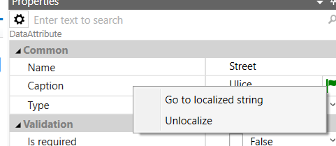

# Localization

Localization is ability to create applications in ScreenFactory that
will allow the user to switch between multiple languages. ScreenFactory
IDE is only in English and there is no intention to localize it.

Localization is optional so first it has to be turned on. That may be
done in menu _Project - Project Options - Localization enabled_.

After that set the languages in _Properties_ of the project (focusing
root node in project window). ScreenFactory supports only some
languages, because it needs to have implementation for number and date
formats, some basic validation error strings etc. At the moment we
support following languages:

- English (en)
- Czech (cz)
- Serbian (rs)
- Finnish (fi)
- Svedish (sv)
- Montenegro (me)

If the language you need is not supported yet, feel free to contact the
developers of ScreenFactory.

At the same place you can set the current language that can be switched
in the right side of application menu (by default above the property
grid). Current language affects

- default language of the application and runtime, ie. calendar, data
  formats etc.
- language for form designer
- default language for work in IDE (in few places the texts will be
  shown in this language)

Language may be set even in projedt that does not have localization on.
It works the same way but it won't be possible to change it in runtime.

## What is localized

- some properties of data object (at the moment it is only Caption)
- strings used in expressions
- some text properties of UI components (ie. Caption, Text etc.)

In default state only runtime is localized. It is necessary to
explicitly set what else should be localized too. This may have to be
done again for any new added elements like entities, attributes, new
forms etc.

## How is it localized

In every package there will be new global node "localizations" (it is
possible to add it in Project tool). If you open it you get
_Localization designer_ view. This allows you to edit the list of
localized strings (identified by LOCID) and their translations for each
language.

## Localization designer

In localization table there are columns for each language. Second column
may show the list of objects that use this string (right mouse context
menu above the column header).

Table is suitable only for small edits. For bigger translations use
tools Export and Import.

On the headers of the columns for each language you can use context
menu.

Note: It may not be good idea to run this on the main default language
column.

- _Translate to pseudolanguage_ – it creates "fake" translation by
  taking original language and transforming its characters into
  unicode characters with accents
- _Auto-translate with online service_ – attempts to translate from
  the default language by use of Microsoft Cognitive Services.

Microsoft Cognitive Services – Translator API may need help if the
launguage code does not match your language. To do that you may add a
resource to the project and name it "microsofttranslator.ini". For
mapping your language code to the code of the translater add following:

\[LangMap\]  
;maps mylng to Serbian in cyrilic alphabet  
mylng=sr-Cyrl

Translation is using cloud service in Microsoft Azure under the account
of ScreenFactory developers. It runs in Free mode that allows to
translate 2 milions of characters per month. If that would not be enough
at some point, it is possible to temporary upgrade it to paid version of
the service for 10\$ per milion of characters.

Rows with individual strings may be chosen (even multiple lines at the
same time) and open context menu:

- _Merge_ – merges multiple strings into one, replacing the first and
  linking all the others to this one
- _Split_ – splits the usage of this string into multiple strings
- _Go to usage_ – navigates to the place where the string is used from
- _Un-localize_ – removes all localizations that are using this string
  (replacing them with literal value) and removes these strings
- _Delete_ – removes the string(s). It can be used only for strings
  that don't have any usage.

LocID may be changed, it will automatically update all expressions where
it is used from.

It is possible to add more strings by clicking on last row (_+Click here
to add new item..._) and then use it in expressions.

Dialog allows to change LocID or use existing one for the same or
similar string. Be mindful of the choice of language (top right of the
dialog; it is taken from current language in IDE).

## Tools

Menu _Tools-Localize_ and right click menu Tools in the Localization
designer contain tools for localization.

- _Localize_ – provides mass localization of chosen package for
  entities, expressions and UI components
- _Export_ – exports chosen packages and languages to excel sheet. It
  requires MS Excel to work properly.
- _Import_ – imports texts from excel sheet. We recommend to import
  sheet that was exported from ScreenFactory before to have best
  chance that ScreenFactory will understand its structure. For corrent
  function it requires MS Excel as well.

## Localized properties

Data elements (entities, attributes, collections etc.) will show flag
icon next to their Caption. It allows to see the state of localization
(on mouse over) or to localize the property. Click on it shows the menu

## Expressions

Individual localized strings are in expressions available as
_localized.{LocID}_, ie. _localized.Hello_. Such expressions in runtime
will have value of the localized string in current language. For
concatenating the strings it is possible to use function
_stringFormat(format, param1, param2, …)_. First parameter will contain
the format string and further parameters will be placed in it instead of
{N} where N is the number of the parameter numbered from 0. For example
_stringFormat("Hello,_ _{0}!",_ _"Karel")_ will result in _"Hello,
Karel!"_. First parameter will usually be the formated string so for
example _stringFormat(localized.HelloFmt, this.name)_.

## UI components

Constant strings in UI may be localized by hand, ie. by creating the
localized string in localization designer, using it in
_ComputedAttribute_ in variables of the form and binding the component
to this computed attribute.

Similar task may be done on selected components with option _Localize UI
Component_ in context menu in _Form designer_.

[HOME](1index.md)
