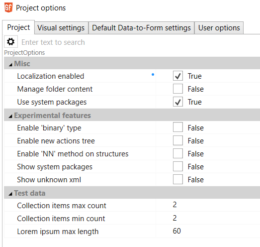
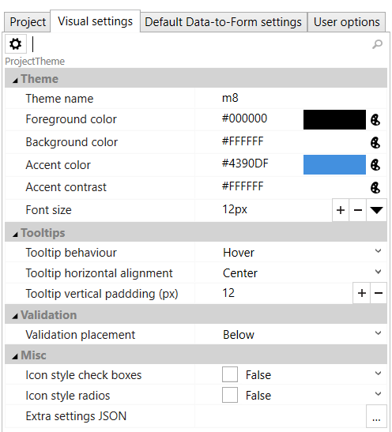
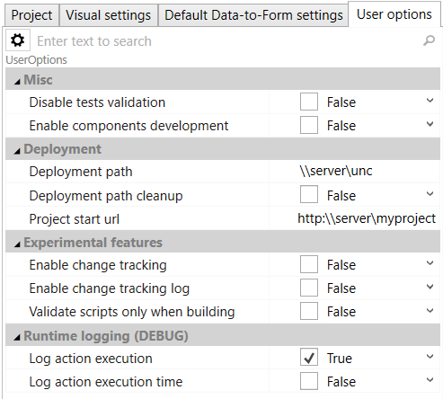

# Project and packages

Project is composed of packages. Every project contains at least one
package. The purpose of packages is to enable sharing parts of the
project between multiple projects. Packages may use other packages
without limitation (including circular references). Packages are as well
a way to add new components to the project (see custom components,
custom api objects). Project contains only packages, project options and
possibly user options. Project must contain at least one package with at
least one form.

Project and its packages are saved in XML files. Either individually
(project separate, packages separate, every artefact separate) or zipped
(one file containing the same structure but in ZIP format). It is
possible to use zipped package in not-zipped project. Project file has
the extension _sfproj_, zipped one _sfprojx_. Package are usually saved
into its own folders and has extension _package_ or _packagex_.

Files may be shared or put into versioning system. In case of versioning
system we recommend not to use zipped format.

Note: ScreenFactory does not have built-in support for any versioning
system.

Next the the project, there is as well file with extension
_sfprojlayout_ that contains informations about layout of windows in IDE
and opened tabs and file with extension _sfuser_ that contains user
settings. We recommend not to share these files between multiple
developers or put them into versioning system. In case of GIT you may
want to consider adding these two estensions to .gitignore.

## Project – build a deployment

For testing and deployment of the project it is needed to run build
(menu _Project - Build and run_ or _Project_ _– Build_). In _User
options_ it is possible to specify output folder where the built
application is copied and it is as well possible to change the address
that is used in the browser to open the application.

### sfcmd.exe – using ScreenFactory from command line

Part of SF IDE is as well sfcmd.exe utility for running some operations
from command line. It allows to run build and tests. For more
information run the utility without parameters or with parameter /?.

### PostBuildCommand

In more complicated scenarios (ie. deploying to multiple locations in
cluster, additional manipulation with deployed files etc.) it is
possible to add to project resource cmd batch (extension cmd) and set
its Action to _PostBuildCommand_. Such script will run after each build
with following parameters:

_{command} {Target folder} {Project name} {ProjectFile}
{Build_output_file}_

In the same time, some system variables will be set (SF_xxx) which are
more readable for further use. To get complete list of variables you can
create new project, add default postBuildCommand and see the result in
Output/Build window

| Name               | Description                                                                                                                                                     |
| ------------------ | --------------------------------------------------------------------------------------------------------------------------------------------------------------- |
| SF_BUILDMODE       | DEBUG or RELEASE                                                                                                                                                |
| SF_NODE            | Path to node.exe. It is possible to use it for running more complex javascript program in connection with SF_TEMPPATH                                           |
| SF_OUTPUT          | Result application file (index.html)                                                                                                                            |
| SF_OUTPUTPATH      | Path to build output                                                                                                                                            |
| SF_PACKAGE_xxx_VER | Version of package xxx. Each package will create its own variable ie. SF_PACKAGE_main_VER                                                                       |
| SF_PROJECTFILE     | Project file (sfproj or sfprojx)                                                                                                                                |
| SF_PROJECTNAME     | Project name                                                                                                                                                    |
| SF_TEMPPATH        | Temporary path that is used by the build process before the files are copied to final location. It is possible to find all resources here and use them further. |

As a template it is possible to use right mouse click on _Package –_
_Add -_ _New Item_ _– Other – Post build command_.

### Project options

Some options are set when you select the root of project tree (SF
Project), some under menu item _Project-Project options_.

In project properties you can set its name, description, window size,
startup form and localizations.

In project options there are several tabs.

### (Note: Table by https://jmalarcon.github.io/markdowntables/ )

| Case                                                                                                                                                                                                                                                                                                                                                                                                                                                                                                                                                                                                                                                                                                                                                                                                                                                                    | Image                                |
| ----------------------------------------------------------------------------------------------------------------------------------------------------------------------------------------------------------------------------------------------------------------------------------------------------------------------------------------------------------------------------------------------------------------------------------------------------------------------------------------------------------------------------------------------------------------------------------------------------------------------------------------------------------------------------------------------------------------------------------------------------------------------------------------------------------------------------------------------------------------------- | ------------------------------------ |
| > Project – settings shared throughout the project, localizations, some experimental features, parameters for generating test data.                                                                                                                                                                                                                                                                                                                                                                                                                                                                                                                                                                                                                                                                                                                                     |  |
| Visual settings – colours, fonts, sizes and other settings used for components. Some parameters are used for generating project CSS stylesheet.                                                                                                                                                                                                                                                                                                                                                                                                                                                                                                                                                                                                                                                                                                                         |  |
| Default Data-to-form settings – default setting for generating the components based on data structures.                                                                                                                                                                                                                                                                                                                                                                                                                                                                                                                                                                                                                                                                                                                                                                 |                                      |
| _User options_ settings that are used only for individual developer. They are saved into separate file with extension sfuser and it is not meant to be added into version control system. It is possible to set.   _Deployment path_ path where the generated application is going to be deployed. It may be empty in which case TEMP is used. In Deployment path cleanup it is possible to check that all content should be always deleted (careful with this settings as by setting the path to wrong location may mean that you delete stuff you don't want deleted)   _Project start url_ – url that will be opened in the browser after building the application with build&run. If it is not set it will open build location as a file   _ Additional settings_ for improving work productivity in IDE (usually by turning off some functions) etc.   |  |

## Packages

It is possible to add artefacts (_Form_, _Data entity_, ...) into them
and structure the artefacts into folders. It is possible to use
predefined structure (_Add New Item -&gt; Standard folders_). Package
has its name and internal identifier. In package properties it is
possible to change alias, that is name that will be used for it in
current project.

Packages have their own version. Each project consists of version number
and when loading it shows warning if package on the disk version does
not match the one the project was saved with.

[HOME](1index.md)
